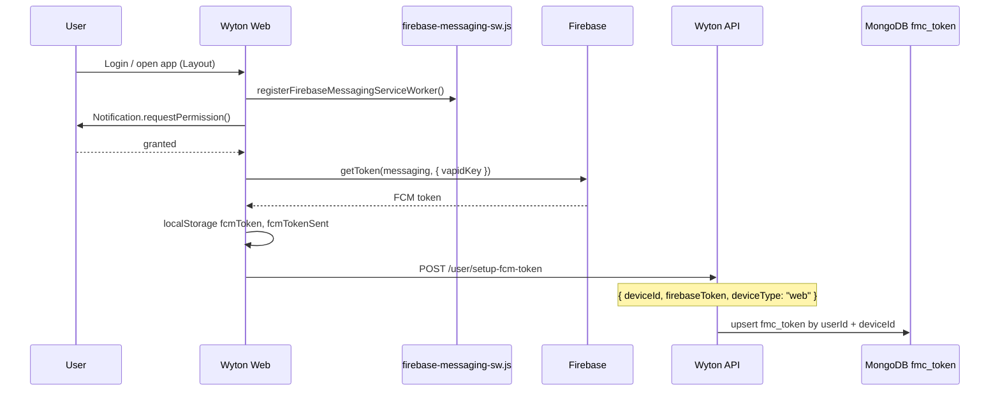
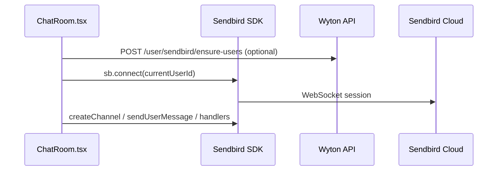
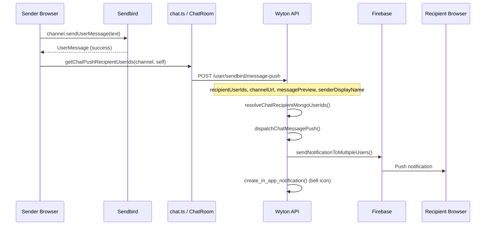
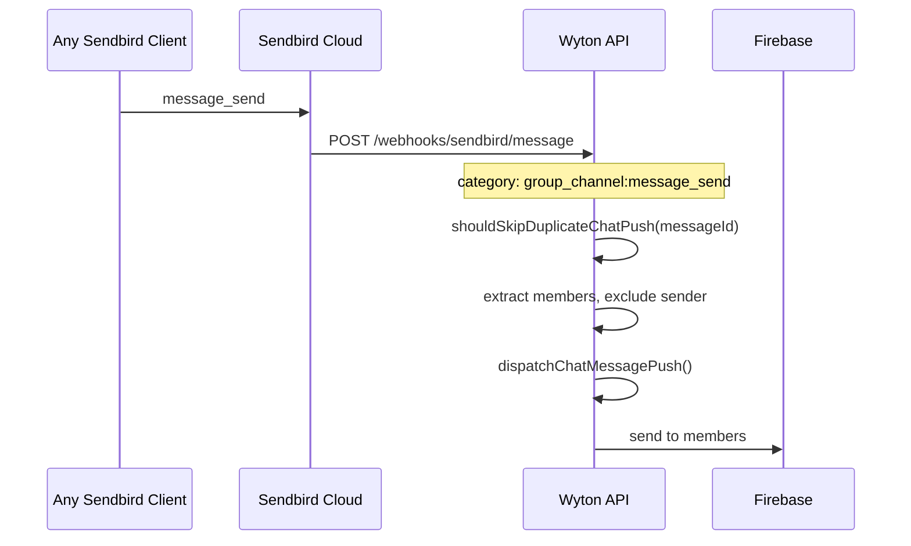
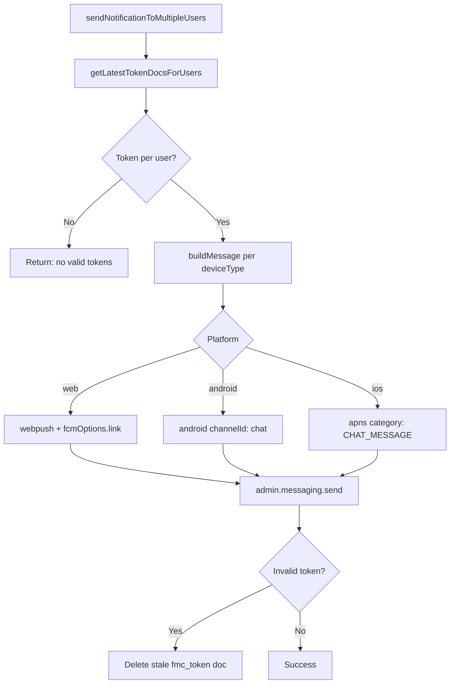
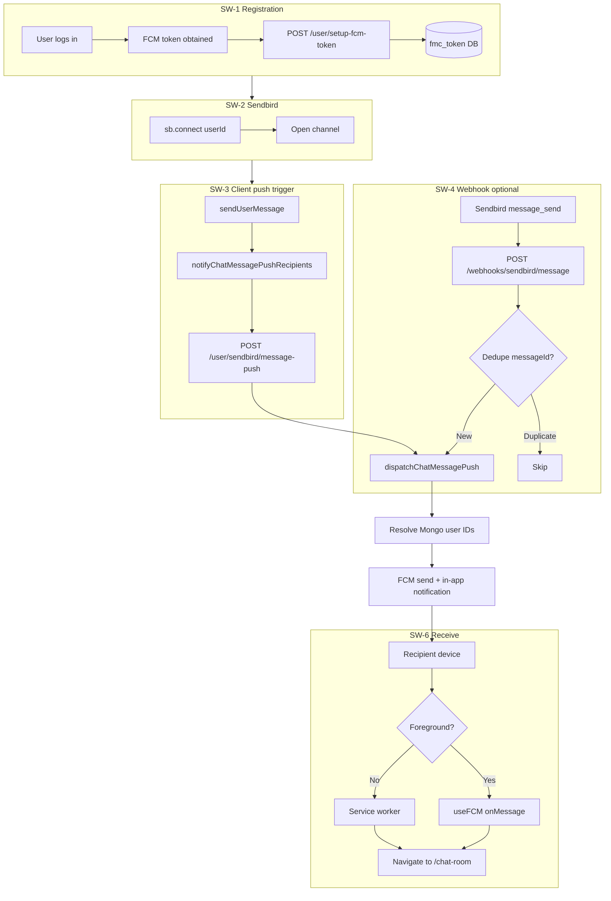

# FCM Push Notifications for Sendbird Chat (Wyton)

This document describes how **Firebase Cloud Messaging (FCM)** is integrated with **Sendbird Chat** in the Wyton platform so users receive push notifications when new chat messages arrive.

The implementation uses a **custom Wyton backend** for FCM delivery (not Sendbird’s built-in push). Sendbird handles real-time messaging; Wyton triggers FCM after a message is sent.

---

## Architecture Overview

```
┌─────────────┐     Sendbird SDK      ┌──────────────┐
│  Wyton Web  │ ────────────────────► │  Sendbird    │
│  (Chat UI)  │ ◄──────────────────── │  Chat Cloud  │
└──────┬──────┘   real-time messages   └──────────────┘
       │
       │ POST /user/sendbird/message-push  (client path)
       │ POST /webhooks/sendbird/message    (webhook path, optional)
       ▼
┌─────────────┐   Firebase Admin SDK   ┌──────────────┐
│  Wyton API  │ ─────────────────────► │  FCM / GCM   │
└──────┬──────┘                        └──────┬───────┘
       │                                      │
       │ MongoDB fmc_token                    │ push payload
       ▼                                      ▼
┌─────────────┐                        ┌──────────────┐
│  Recipients │ ◄── in-app bell + ──── │  Browser /   │
│  (users)    │     deep-link          │  Mobile app  │
└─────────────┘                        └──────────────┘
```

**Key design decisions**

| Topic | Wyton approach |
|-------|----------------|
| Push provider | Firebase Cloud Messaging (FCM) |
| Chat provider | Sendbird Group Channels |
| Who sends FCM? | Wyton API (`fcmPushNotification.js`) |
| Token storage | MongoDB `fmc_token` collection |
| User ID mapping | Sendbird user IDs (often email) → MongoDB `users._id` |
| Dual trigger | Client callback **and** optional Sendbird webhook (with dedupe) |

---

## Sub-Workflows (Super-Works)

Use these numbered flows when debugging or extending the integration.

### SW-1: Device Registration (FCM Token Setup)

**Goal:** Store each user’s FCM token on the backend so pushes can be delivered.



**Files**

| Layer | File | Role |
|-------|------|------|
| Web | `wyton-web/src/config/firebase.ts` | Firebase init, SW registration, `getToken`, foreground listener |
| Web | `wyton-web/public/firebase-messaging-sw.js` | Background notifications + click navigation |
| Web | `wyton-web/src/hooks/useFCM.ts` | Foreground handler, in-app toast, click → navigate |
| Web | `wyton-web/src/components/layout/Layout.tsx` | Calls `setupFCMToken` after login |
| Web | `wyton-web/src/pages/auth/VerifyOTP.tsx` | Optional token send at OTP verify |
| API | `wyton-api/controllers/users.js` → `setupFcmToken` | Validates auth, saves token |
| API | `wyton-api/services/userServices.js` → `manage_fmc_token` | Upsert `fmc_token` |
| API | `wyton-api/model/fmc-token-model.js` | Schema: `userId`, `firebaseToken`, `deviceId`, `deviceType` |

**API**

```
POST /user/setup-fcm-token
Authorization: Bearer <jwt>
Body: {
  "deviceId": "<stable-browser-id>",
  "firebaseToken": "<fcm-registration-token>",
  "deviceType": "web" | "ios" | "android"
}
```

**Environment (Web)**

```env
VITE_FIREBASE_API_KEY=
VITE_FIREBASE_AUTH_DOMAIN=
VITE_FIREBASE_PROJECT_ID=
VITE_FIREBASE_STORAGE_BUCKET=
VITE_FIREBASE_MESSAGING_SENDER_ID=
VITE_FIREBASE_APP_ID=
VITE_FIREBASE_VAPID_KEY=          # Firebase Console → Cloud Messaging → Web Push certificates
```

**Environment (API)**

- Firebase Admin SDK: `wyton-api/config/wyton-notification-firebase-adminsdk.json`

---

### SW-2: Sendbird Chat Connection

**Goal:** Connect the logged-in user to Sendbird before sending/receiving messages.



**Files**

| File | Role |
|------|------|
| `wyton-web/src/services/sendbird.ts` | `SendbirdChat.init({ appId, modules })` |
| `wyton-web/src/pages/ChatRoom/ChatRoom.tsx` | `sb.connect(currentUserId)`, send handlers |
| `wyton-web/src/services/chat.ts` | Channel CRUD, `sendMessage`, listeners |
| `wyton-api/controllers/users.js` → `ensureSendbirdUsers` | Creates missing Sendbird users via REST API |

**Environment (Web)**

```env
VITE_SENDBIRD_APP_ID=<sendbird-application-id>
```

**Environment (API)**

```json
"SENDBIRD_APP_ID": "...",
"SENDBIRD_API_TOKEN": "..."
```

**Note:** Sendbird `user_id` in Wyton is typically the user’s email or MongoDB id string — must match what `resolveChatRecipientMongoUserIds` can resolve.

---

### SW-3: Message Send → Push Dispatch (Primary Client Path)

**Goal:** After a message is successfully sent via Sendbird, notify the Wyton API to push all other channel members.



**Trigger points in `ChatRoom.tsx`**

Push is fired **after successful send** for:

- Text messages
- Linkable items (tasks, action plans, etc.)
- File / audio attachments

Pattern (non-blocking, fire-and-forget):

```typescript
void notifyChatMessagePushRecipients({
  recipientUserIds: getChatPushRecipientUserIds(selectedChannel, currentUserId, extraMemberIds),
  channelUrl: selectedChannel.url,
  channelName: "...",
  messagePreview: text,
  senderDisplayName: selfNickname,
});
```

**Recipient resolution (`getChatPushRecipientUserIds`)**

1. Read Sendbird channel `members[].userId`
2. Merge optional `extraMemberIds` (group roster lag workaround)
3. Exclude the sender’s `currentUserId`

**API**

```
POST /user/sendbird/message-push
Authorization: Bearer <jwt>  (sender must be authenticated)
Body: {
  "recipientUserIds": ["user@email.com", "507f1f77bcf86cd799439011"],
  "channelUrl": "sendbird_group_channel_...",
  "channelName": "Project Team",
  "messagePreview": "Hello team",
  "senderDisplayName": "Jane Doe"
}
```

**Backend pipeline (`dispatchChatMessagePush`)**

1. Normalize up to **200** recipient identifiers
2. `resolveChatRecipientMongoUserIds` — map email/username/ObjectId → Mongo `users._id`
3. Exclude sender from recipients
4. Build notification:
   - `type` / `module`: `CHAT_MESSAGE`
   - `title`: `{sender} · {channelName}` or `{sender}`
   - `message`: preview (max 220 chars)
   - `redirectUrl`: `/chat-room?channelUrl=<encoded>`
5. `fcmPushNotification.sendNotificationToMultipleUsers(mongoIds, notification)`
6. `create_in_app_notification` for bell dropdown

---

### SW-4: Sendbird Webhook Path (Server-Side Backup)

**Goal:** Dispatch push when messages are sent from any client (mobile app, future clients) without relying on the web UI callback.



**Files**

| File | Role |
|------|------|
| `wyton-api/routes/webhookRoute.js` | `POST /webhooks/sendbird/message` (no JWT auth) |
| `wyton-api/controllers/users.js` → `handleSendbirdMessageWebhook` | Parse payload, dedupe, dispatch |

**Sendbird Dashboard setup**

1. Go to **Settings → Webhooks**
2. Add webhook URL: `https://<api-host>/webhooks/sendbird/message`
3. Enable event: **`group_channel:message_send`**
4. Set secret → `SENDBIRD_WEBHOOK_SECRET` in API config
5. Sendbird sends header `x-webhook-secret` or `x-sendbird-signature` (must match secret)

**Dedupe**

- In-memory map keyed by `message_id`
- TTL: **60 seconds**
- Prevents double push when **both** client path (SW-3) and webhook (SW-4) fire

---

### SW-5: FCM Delivery (Backend)

**Goal:** Look up tokens and send platform-specific FCM messages.

**File:** `wyton-api/utils/fcmPushNotification.js`



**Chat notification payload (data fields)**

| Field | Example | Purpose |
|-------|---------|---------|
| `type` | `CHAT_MESSAGE` | Notification routing |
| `module` | `CHAT_MESSAGE` | Same |
| `channelUrl` | `sendbird_group_channel_...` | Deep link to channel |
| `redirectUrl` | `/chat-room?channelUrl=...` | SPA navigation |
| `title` | `Jane · Project Team` | Display |
| `body` | `Hello team` | Display |

**Token selection**

- Latest `updatedAt` token per `userId`
- Ignores invalid placeholders (`""`, `"string"`, `"null"`)
- Minimum token length: 20 chars

---

### SW-6: Push Receive & Deep Link (Web Client)

**Goal:** Show notification and open the correct chat when the user clicks.

#### Foreground (app tab active)

`useFCM.ts` → `setupMessageListener` → `onMessage`:

1. `getNotificationNavigationTarget(data)` resolves path
2. Dispatches to Redux `notificationSlice` (in-app list)
3. Shows native `Notification` if permission granted
4. `onclick` → `navigate(/chat-room?channelUrl=...)`

#### Background (tab inactive / closed)

`firebase-messaging-sw.js`:

1. `onBackgroundMessage` → `showNotification`
2. `notificationclick` → `resolveNotificationPath(data)`
3. Focus existing window + `postMessage({ type: "FCM_NOTIFICATION_NAVIGATE", path })`
4. Or `clients.openWindow(targetUrl)`

**Navigation helper:** `wyton-web/src/lib/notificationNavigation.ts`

```typescript
// CHAT_MESSAGE + channelUrl → /chat-room?channelUrl=<encoded>
getNotificationNavigationTarget(data)
```

**ChatRoom deep link:** `ChatRoom.tsx` reads `channelUrl` query param and selects that channel on load.

---

## End-to-End Flow (All Sub-Works Combined)



---

## API Reference Summary

| Method | Path | Auth | Description |
|--------|------|------|-------------|
| POST | `/user/setup-fcm-token` | JWT | Register/update FCM token |
| POST | `/user/logout` | JWT | Delete FCM token for device |
| POST | `/user/sendbird/message-push` | JWT | Dispatch chat push (client path) |
| POST | `/user/sendbird/ensure-users` | JWT | Create Sendbird users if missing |
| POST | `/webhooks/sendbird/message` | Webhook secret | Sendbird `message_send` webhook |

---

## Configuration Checklist

### Firebase Console

- [ ] Create Firebase project
- [ ] Add Web app → copy config to `VITE_FIREBASE_*`
- [ ] Generate **Web Push certificate (VAPID key)** → `VITE_FIREBASE_VAPID_KEY`
- [ ] Download **Service Account JSON** → `wyton-api/config/wyton-notification-firebase-adminsdk.json`
- [ ] Ensure `messagingSenderId` in web config matches Admin SDK project

### Sendbird Dashboard

- [ ] Create application → `VITE_SENDBIRD_APP_ID`, `SENDBIRD_API_TOKEN`
- [ ] (Optional) Webhook for `group_channel:message_send`
- [ ] (Optional) `SENDBIRD_WEBHOOK_SECRET` in API config

### Wyton Web

- [ ] Run `inject-firebase-config.js` build step so SW has correct Firebase config
- [ ] `useFCM()` mounted in Navbar (main + vendor layouts)
- [ ] User grants notification permission

### Wyton API

- [ ] MongoDB `fmc_token` collection accessible
- [ ] Firebase Admin SDK initialized
- [ ] Sendbird credentials in `config/default.json` / env-specific config

---

## Troubleshooting

| Symptom | Likely cause | Check |
|---------|--------------|-------|
| No push at all | Token not in DB | `POST /user/setup-fcm-token` success? `fmc_token` row for user? |
| Push for some users only | Sendbird ID ≠ resolvable user | `recipientUserIds` must be email or valid Mongo ObjectId |
| Double notifications | Client + webhook both fire | Dedupe window 60s; disable one path if needed |
| `senderid mismatch` | Wrong Firebase project | Web `messagingSenderId` vs Admin SDK JSON project |
| No foreground toast | `useFCM` not mounted | Navbar / NewNavbar imports |
| Click doesn’t open chat | Missing `channelUrl` in data | Inspect FCM `data` payload |
| Webhook 401 | Secret mismatch | `SENDBIRD_WEBHOOK_SECRET` vs Sendbird header |
| Stale token errors | Old device token | Auto-deleted on `messaging/invalid-registration-token` |

---

## Mobile (iOS / Android) Notes

The same backend supports mobile via `deviceType: "ios" | "android"`:

- Android uses `channelId: "chat"` and `clickAction: "FLUTTER_NOTIFICATION_CLICK"`
- iOS uses APNS `category: "CHAT_MESSAGE"`

Mobile apps should:

1. Obtain FCM token from Firebase SDK
2. `POST /user/setup-fcm-token` with correct `deviceType`
3. Connect to Sendbird with the same `user_id` scheme as web
4. Either call `/user/sendbird/message-push` after send **or** rely on Sendbird webhook (SW-4)

---

## Related Source Files (Quick Index)

```
wyton-web/
  src/config/firebase.ts
  src/hooks/useFCM.ts
  src/lib/notificationNavigation.ts
  src/services/sendbird.ts
  src/services/chat.ts
  src/pages/ChatRoom/ChatRoom.tsx
  public/firebase-messaging-sw.js

wyton-api/
  utils/fcmPushNotification.js
  controllers/users.js          # dispatchChatMessagePush, webhook, setupFcmToken
  routes/userRoute.js           # /user/sendbird/message-push, /user/setup-fcm-token
  routes/webhookRoute.js        # /webhooks/sendbird/message
  model/fmc-token-model.js
  services/userServices.js      # manage_fmc_token
```

---

*Last updated from codebase analysis — Wyton monorepo.*
