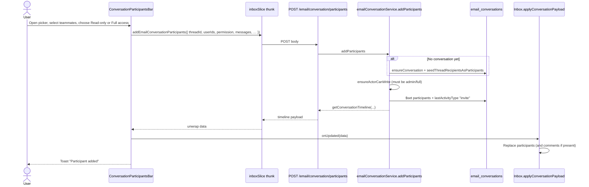

# Inbox Email — Participant Attach Flow (Add / Update / Remove)

**Scope:** Attaching **Wyton teammates** to a Front-style conversation overlay on a Gmail thread in Inbox Email.

**Not in scope:** Gmail MIME file attachments, comment `dataUrl` attachments, or email To/Cc/Bcc recipients. Those are separate systems (see [Related paths](#related-paths-not-this-flow)).

---

## Mental model

| Concept | Meaning |
|---------|---------|
| Conversation | Mongo `email_conversations` doc keyed by `(mailboxUserId, threadId)` |
| Participant | Internal teammate with ACL: `admin` \| `permanent` \| `full` \| `readonly` |
| Owner / admin | `ownerUserId` is conversation starter / host identity; **any Admin** participant can change permissions or remove Full/Read-only |
| Attach (UI) | Add teammate via `ConversationParticipantsBar` (not email Cc) |

Permissions:

- **admin** — full write + can remove/change Full and Read-only (not Admin/Permanent)
- **permanent** — send/reply/add like Full; cannot remove or change permissions; cannot be removed/downgraded
- **full** — comment, react, reply, add participants; first outbound reply promotes to Permanent
- **readonly** — view emails, comments, shared drafts only

On first conversation seed, internal From/To/Cc become **admin**. External From inbound promotes To/Cc internals to **permanent** (Admins unchanged).
---

## Key files

| Layer | Path | Role |
|-------|------|------|
| UI | `wyton-web/src/components/email/EmailConversationCollaboration.tsx` | `ConversationParticipantsBar` — add / update / remove |
| Host | `wyton-web/src/pages/Inbox/Inbox.tsx` | Mounts bar; `applyConversationPayload` merges state |
| Redux | `wyton-web/src/store/slices/inboxSlice.ts` | Thunks → `POST` / `PATCH` / `DELETE` |
| Types | `wyton-web/src/utils/emailConversationTimeline.ts` | `ConversationParticipant`, `EmailConversationPayload` |
| Routes | `wyton-api/routes/emailInboxRoute.js` | `/email/conversation/participants` |
| Controller | `wyton-api/controllers/emailInbox.js` | `add` / `update` / `remove` handlers |
| Service | `wyton-api/services/emailConversationService.js` | `addParticipants`, `updateParticipantPermission`, `removeParticipant` |
| Model | `wyton-api/model/emailConversationModel.js` | Embedded `ParticipantSchema` |

---

## API surface

Auth: `userAuth` on all three.

| Action | Method | Path | Who can |
|--------|--------|------|---------|
| Add | `POST` | `/email/conversation/participants` | Actor with `admin` or `full` (`canWrite`) |
| Update permission | `PATCH` | `/email/conversation/participants` | Any **Admin** participant; target Full/Read-only only |
| Remove | `DELETE` | `/email/conversation/participants` | Any **Admin** participant; target Full/Read-only only |

### Request bodies

**ADD**

```json
{
  "threadId": "string (required)",
  "userIds": ["string", "..."],
  "permission": "full | readonly",
  "messages": [{ }],
  "subject": "string?",
  "snippet": "string?",
  "latestMessageId": "string?"
}
```

**UPDATE**

```json
{
  "threadId": "string",
  "targetUserId": "string",
  "permission": "full | readonly"
}
```

**REMOVE**

```json
{
  "threadId": "string",
  "targetUserId": "string"
}
```

### Responses

| Action | Success payload shape |
|--------|----------------------|
| ADD | Full conversation timeline (`participants`, `comments`, `timeline`, `canWrite`, …) |
| UPDATE | Lean Mongo conversation document (FE mostly ignores; patches local list) |
| REMOVE | `{ ok: true }` (FE filters local list) |

---

## ADD flow



### UI steps

1. Thread toolbar shows `ConversationParticipantsBar` (`Inbox.tsx`).
2. If `canWrite`, user opens **+ / Add participants**.
3. Options come from `fetchAvailableMembers`, excluding existing `participants`.
4. Multi-select → **Add** → permission dialog (**Read-only** vs **Full access**).
5. `addUsers(userIds, permission)` dispatches the ADD thunk.

### Server behavior

1. Resolve conversation via `getAccessibleConversation`; if missing, `ensureConversation` then seed Wyton To/Cc/From as `recipient: true`, `permission: "admin"`.
2. `ensureActorCanWrite` — readonly actors get **403** `"Cannot add participants"`.
3. Skip duplicate `userIds`; append rows with `recipient: false`, `unread: true`, chosen permission (default **full**).
4. Persist and return **full timeline**.

---

## UPDATE flow (permission)

```mermaid
sequenceDiagram
  actor Admin
  participant Bar as ConversationParticipantsBar
  participant Redux as inboxSlice thunk
  participant API as PATCH /email/conversation/participants
  participant Svc as updateParticipantPermission
  participant DB as email_conversations
  participant Inbox as Inbox.applyConversationPayload

  Admin->>Bar: Change select (Read-only / Full access) on non-owner row
  Bar->>Redux: updateEmailConversationParticipant({ threadId, targetUserId, permission })
  Redux->>API: PATCH body
  API->>Svc: updateParticipantPermission
  Svc->>Svc: Actor must be Admin participant; cannot change Admin/Permanent
  Svc->>DB: $set participants.$.permission
  Svc-->>API: lean conversation doc
  API-->>Redux: success
  Redux-->>Bar: ok
  Note over Bar: Does not use server list shape
  Bar->>Inbox: onUpdated({ participants: mapped locally, comments: [], timeline: [] })
  Inbox->>Inbox: setConvParticipants(mapped); setConvComments([])
```

### Rules

- UI controls only when `isAdmin` and target is not Admin/Permanent.
- Server: any Admin participant; target only `full`/`readonly`.
- FE **locally maps** the updated permission; it does not refresh from a timeline response.

> **State quirk:** `onUpdated` passes `comments: []`. Because `applyConversationPayload` treats any array as authoritative, **comments clear in the UI** after a permission change until the next timeline fetch.

---

## REMOVE flow

```mermaid
sequenceDiagram
  actor Admin
  participant Bar as ConversationParticipantsBar
  participant Redux as inboxSlice thunk
  participant API as DELETE /email/conversation/participants
  participant Svc as removeParticipant
  participant DB as email_conversations
  participant Inbox as Inbox.applyConversationPayload

  Admin->>Bar: Click Remove on non-owner row
  Bar->>Redux: removeEmailConversationParticipant({ threadId, targetUserId })
  Redux->>API: DELETE with JSON body
  API->>Svc: removeParticipant
  Svc->>Svc: Actor must be Admin participant; cannot remove Admin/Permanent
  Svc->>DB: $pull participants by userId
  Svc-->>API: true
  API-->>Redux: { ok: true }
  Bar->>Inbox: onUpdated({ participants: filtered locally, comments: [], timeline: [] })
  Inbox->>Inbox: setConvParticipants(filtered); setConvComments([])
  Bar-->>Admin: Toast "Participant removed"
```

### Rules

- Same Admin ACL gate as UPDATE (Full/Read-only targets only).
- Same `comments: []` local-patch quirk as UPDATE.

---

## Permissions matrix

| Action | admin | permanent | full | readonly |
|--------|-------|-----------|------|----------|
| Add participants | Yes | Yes | Yes | No (403) |
| Change permission (Full↔Read-only) | Yes | No | No | No |
| Remove participant (Full/Read-only) | Yes | No | No | No |
| Change/remove Admin or Permanent | No | No | No | No |

UI copy: *“Admins can change permissions or remove Full access and Read-only participants.”*

FE `isAdmin` is true when `convPermission === "admin"` (or owner / single-participant bootstrap).

---

## Live / WebSocket

Participant CRUD does **not** publish WS events.

| Channel | Participant ADD/UPDATE/REMOVE? |
|---------|----------------------------------|
| `/email/conversation/ws` (comments, presence, drafts, …) | No |
| Inbox activity notify (Primary bump) | Used on **comment** post, not on participant CRUD |

Other viewers see participant changes only after timeline refetch (open thread / reconnect), not live.

---

## Edge cases

- **Lazy create:** Conversation is also created/updated on outbound send, inbound external From sync, and invite/comment/reply collab — not only the participants bar.
- **Duplicates:** ADD skips users already in `participants`.
- **Seeding:** On create, Wyton users on To/Cc/From become participants with `recipient: true`, `permission: "admin"`.
- **Reply auto-attach:** Internal To/Cc on later reply can be added as **readonly** (`ensureReadonlyParticipantsFromReplyRecipients`).
- **Client inbound:** External From → To/Cc internals → **permanent** (Admins never auto-promoted).
- **Full first reply:** Sender with `full` → **permanent** after successful outbound send.
- **Mentions:** Comment `@mentions` can auto-add non-participants as **full** on the backend (orthogonal to the participants bar).
- **Readonly stickiness:** Explicit readonly invites are not silently upgraded to full (except owner/mailbox owner paths).
- **Thread bridge:** Invitees opening their own Gmail `threadId` may resolve the host conversation via RFC Message-ID bridge.

---

## Related paths (not this flow)

| Concern | Where |
|---------|--------|
| Comment file chips (`dataUrl`, max 5) | `POST /email/conversation/comment` + `ConversationCommentComposer` |
| Outbound / inbound Gmail attachments | `InboxInlineReplyComposer` / Gmail attachment APIs |
| Email To/Cc (external) | Compose / reply send path — not conversation participants |
| Role design (Cases 1–6) | `docs/superpowers/specs/2026-09-25-email-thread-participant-roles-design.md` |

---

## Quick reference — call chain

```
UI  ConversationParticipantsBar.addUsers | changePermission | removeUser
 →  inboxSlice  addEmailConversationParticipants | update… | remove…
 →  api  POST | PATCH | DELETE  /email/conversation/participants
 →  emailInboxController  add… | update… | remove…
 →  emailConversationService  addParticipants | updateParticipantPermission | removeParticipant
 →  Mongo  email_conversations.participants
 →  FE  onUpdated → Inbox.applyConversationPayload
```