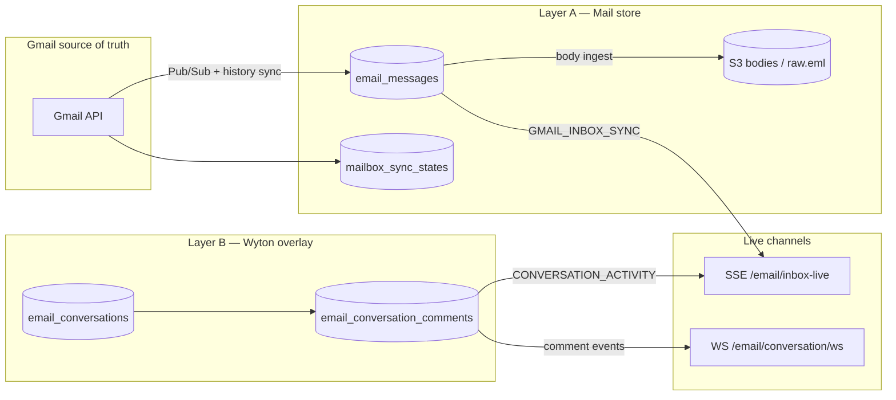
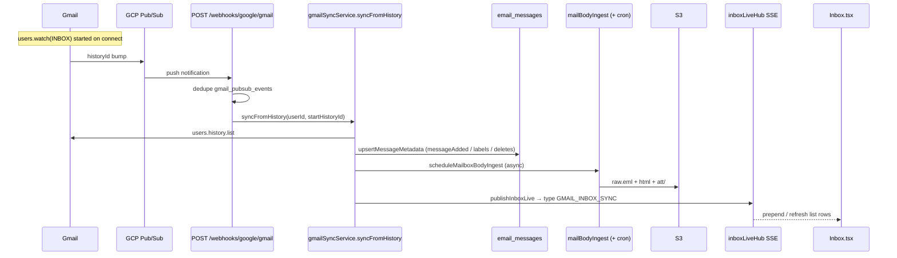
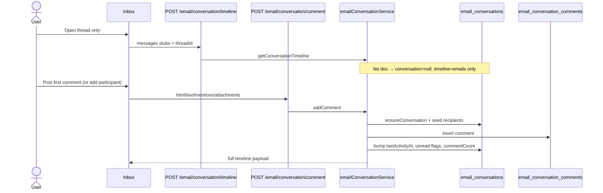
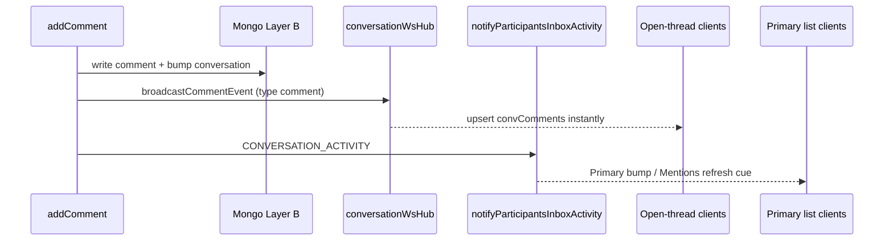
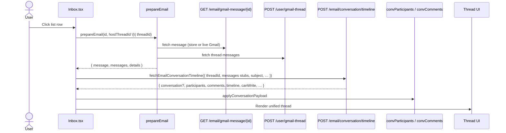

# Inbox Email — Storage, Sync & Frontend Render Flow

Companion to [inbox-email-participant-attach-flow.md](./inbox-email-participant-attach-flow.md).

**Scope:** How Gmail mail lands in Mongo/S3, how internal comments are stored, how live sync reaches the browser, and how the Inbox FE opens and renders a thread.

There is **no separate SMTP “email server” product**. The “new” inbox stack is a **Depth-2 local mail store** (Mongo metadata + S3 bodies) fed by Gmail History / Pub/Sub, plus a **Wyton-only conversation overlay** (participants + comments).

---

## Two layers (read this first)



| Layer | Collections | Created when | Synced via Gmail? |
|-------|-------------|--------------|-------------------|
| **A — Mail store** | `email_messages`, `mailbox_sync_states`, S3 | Connect / Pub/Sub / cron | **Yes** |
| **B — Overlay** | `email_conversations`, `email_conversation_comments` | First comment / invite / assign / reply seed | **No** (Wyton-only) |

Opening an email alone loads Layer A. Layer B is created only on the first collab action (lazy).

---

## 1. Email data storage (Layer A)

### Collections

| Collection | Model | Role |
|------------|-------|------|
| `email_messages` | `wyton-api/model/emailMessageModel.js` | Per-mailbox Gmail message metadata + body pointers |
| `mailbox_sync_states` | `wyton-api/model/mailboxSyncStateModel.js` | History cursor, backfill, counters |
| `gmail_pubsub_events` | `wyton-api/model/gmailPubsubEventModel.js` | Pub/Sub idempotency (TTL ~7 days) |
| S3 | `mailStoreKeys` / `mailStoreService` | `raw.eml`, sanitized HTML, attachments |

User flags that matter (`users`): `isGmailConnected`, `googleConnectedEmail`, `gmailHistoryId`, `gmailSyncInitialized`, `gmailWatchExpiration`, `activeMailboxUserId`.

### `email_messages` fields that matter

- **Identity:** `userId`, `googleConnectedEmail`, `messageId`, `threadId`, `rfcMessageId`
- **List/headers:** `from` / `fromRaw`, `to`, `cc`, `subject`, `snippet`, `internalDate`, `labelIds`, `hasAttachment`
- **Lifecycle:** `isDeleted`, `deleteKind` (`trashed`|`permanent`), `gmailHistoryId`, `lastMutationHistoryId`
- **Body:** `body.state` ∈ `pending|stored|failed|purged`; `raw_key`, `html_key`, capped `text`
- **Attachments:** `attachments[].{filename, mime, size_bytes, s3_key, content_id, …}`
- **Unique index:** `(userId, googleConnectedEmail, messageId)`

Bodies are **not** stored as full blobs in Mongo. Content-addressed S3 keys use `sha256(rfcMessageId)` so the same RFC message across mailboxes can share storage.

> `email_inbox_documents` is a **separate** SES/docs ingest path — not the Gmail Inbox thread store.

---

## 2. How new mail syncs into the store



### Entry points

| Trigger | Path / job | What runs |
|---------|------------|-----------|
| Connect / first init | `POST /email/gmail-sync/initialize` | `fullResyncGmailInbox` + watch + backfill |
| Pub/Sub push | `POST /webhooks/google/gmail` | `handleGmailPubSub` → `syncFromHistory` |
| Manual / FE poll | `POST /email/gmail-sync/trigger` | `syncFromHistory` (~15s on Primary page 0) |
| Missed push | `jobs/gmailHistoryCatchUpCron.js` (*/15) | stale mailboxes → `syncFromHistory` |
| Watch expiry | `jobs/gmailWatchRenewalCron.js` | `renewExpiringWatches` |
| History 404 | inside `syncFromHistory` | fallback `fullResyncGmailInbox` |
| Historical | `mailBackfillService` + cron | older than initial INBOX snapshot |

List reads prefer local store: `GET /email/gmail-inbox?preferLocal=true` → `listLocalInboxMessages`.

Open body: `mailStoreReadService.tryBuildStoredMessageResponse` with **live Gmail fallback** if `body.state` is not `stored`.

### Sync does **not** write comments

Gmail Pub/Sub only updates Layer A (`email_messages` + S3). Comments stay on Layer B and never ride the Gmail history pipeline.

---

## 3. Comments & conversation overlay (Layer B)

### Collections

| Collection | Model | Role |
|------------|-------|------|
| `email_conversations` | `emailConversationModel.js` | One doc per `(mailboxUserId, threadId)` — participants, activity, shared draft |
| `email_conversation_comments` | `emailConversationCommentModel.js` | Internal notes (+ optional outbound email mirrors) |

### Comment fields that matter

- Links: `conversationId`, `threadId`, `mailboxUserId`, `authorUserId`
- Body: `html`, `text`
- `kind`: `"comment"` (default) \| `"email"` (assignee outbound mirrored into shared timeline)
- `emailMeta` when `kind:"email"`: from/to/cc/subject/`gmailMessageId`
- Mentions: `mentionedUserIds[]` (auto-added as participants)
- Attachments: embedded `{ name, mimeType, size, dataUrl }` — **base64 in Mongo**, max 5, ~1.5MB each (not S3 mail store)
- Placement: `afterEmailCount`, `activityAt` (sort key; edits do not move it)
- Also: `reactions`, `parentCommentId`, `deleted`, `editedAt`

### Conversation create (lazy)



Key service functions (`emailConversationService.js`):

- `ensureConversation`, `getConversationTimeline`, `buildTimeline`
- `addComment`, `editComment`, `deleteComment`, `reactToComment`
- `recordOutboundEmailReply` (`kind: "email"`)
- Participants: see companion participant-attach doc

### Comment post → live notify



---

## 4. Frontend — list + open + render

### Key FE files

| Path | Role |
|------|------|
| `wyton-web/src/pages/Inbox/Inbox.tsx` | List, SSE, Mentions, open thread, merge state |
| `wyton-web/src/pages/Inbox/conversation/prepareEmail.ts` | Hydrate message + thread before paint |
| `wyton-web/src/utils/emailConversationTimeline.ts` | Merge helpers + types |
| `wyton-web/src/store/slices/inboxSlice.ts` | Gmail + collab thunks |
| `wyton-web/src/components/email/EmailConversationCollaboration.tsx` | Comments list, composer, participants bar |
| `wyton-web/src/pages/Inbox/collaboration/useConversationLive.ts` | WS presence + comment events |
| `wyton-web/src/components/email/EmailBodyDisplay.tsx` | Gmail HTML body |
| `wyton-web/src/components/email/InboxInlineReplyComposer.tsx` | External reply |

### Connect / Primary list

```text
Gmail connected
  → POST /email/gmail-sync/initialize   (once)
  → GET  /email/gmail-inbox?preferLocal=true
  → GET  /email/inbox-live              (SSE)
  → GET  /email/conversations/active    (Primary overlay / Mentions)
```

SSE handling in `Inbox.tsx`:

| Event `type` | Effect |
|--------------|--------|
| `GMAIL_INBOX_SYNC` | Prepend / refresh Gmail list rows (`applyInboxDelta`) |
| `CONVERSATION_ACTIVITY` | Overlay activity on Primary (`applyConversationActivityDelta`) |

Mentions view (`mailboxView === "mentions"`) uses **only** active conversations — no Gmail list fetch.

### Open thread sequence



`prepareEmail` tip-fallback: if a Mentions/activity row’s `latestMessageId` 404s, it resolves the **latest message inside the same authorized thread** — never another mailbox/subject.

### How emails + comments render together

1. **Server** `buildTimeline({ messages, comments })`  
   - Gmail msgs → items `type: "email"` / `"reply"`  
   - Comments → items `type: "comment"`  
   - Sorted by `sortKey` from `activityAt` / `internalDate`

2. **FE merge** (`emailConversationTimeline.ts` + `Inbox.tsx`)  
   - `mergeThreadWithOutboundEmails` — folds `kind:"email"` comment mirrors into email cards  
   - `buildUnifiedConversationItems` / grouping helpers — place internal comments between emails

3. **Paint**  
   - **Email cards:** headers + `EmailBodyDisplay` (S3 store or live Gmail); latest expanded by default  
   - **Comment cards:** `ConversationCommentList` — HTML, reactions, `dataUrl` attachment chips  
   - **Participants:** `ConversationParticipantsBar`  
   - **Composer:** `ConversationCommentComposer` (mentions + paperclip)  
   - **External reply:** `InboxInlineReplyComposer` (MIME attachments → Gmail send)

### Live updates while thread is open

| Channel | Endpoint | What updates UI |
|---------|----------|-----------------|
| WS | `/email/conversation/ws` | `comment`, `comment_deleted`, presence, receipts, shared draft, `reply_sent` |
| SSE | `/email/inbox-live` | New Gmail rows + Primary activity bumps |
| Poll | `POST /email/gmail-sync/trigger` | Delta prepend fallback |

`useConversationLive` → `onCommentEvent` upserts `convComments` without a full timeline reload.

---

## 5. Shared / assigned mailbox access

Participants on `email_conversations` can open the **host** mailbox thread without switching accounts:

1. List / Mentions may carry `sharedThreadId`
2. Open remaps via `resolveEffectiveMailboxUserId` / `resolveSharedMailboxAccess`
3. If invitee’s own Gmail `threadId` ≠ host, `findConversationViaRfcThreadBridge` matches on shared `rfcMessageId` across `email_messages`

Permissions (`admin` / `full` / `readonly`) gate comment + reply + participant CRUD (see companion doc).

---

## 6. End-to-end cheat sheet

```text
CONNECT
  POST /email/gmail-sync/initialize
  startGmailWatch → Pub/Sub

NEW EMAIL ARRIVES
  Pub/Sub → POST /webhooks/google/gmail
    → syncFromHistory → email_messages
    → schedule body ingest → S3
    → SSE GMAIL_INBOX_SYNC → FE list prepend

OPEN THREAD
  GET  /email/gmail-message/{id}?threadId=
  POST /user/gmail-thread
  POST /email/conversation/timeline
    → merge Layer A messages + Layer B comments (if any)

POST COMMENT
  POST /email/conversation/comment
    → ensureConversation (if first)
    → email_conversation_comments insert
    → WS comment + SSE CONVERSATION_ACTIVITY

PARTICIPANTS
  POST|PATCH|DELETE /email/conversation/participants
    → (see inbox-email-participant-attach-flow.md)
```

---

## 7. Edge cases

1. **Lazy overlay** — open alone does not create `email_conversations`.
2. **History expiry (404)** — full INBOX resync + backfill.
3. **Mutation suppression** — `lastMutationHistoryId` skips echo of own label changes.
4. **Body pending/failed** — UI still works via live Gmail fallback.
5. **Comment attachments** — Mongo `dataUrl`; Gmail MIME attachments are separate (S3 / Gmail API).
6. **RFC thread bridge** — invitee threadId may differ from host; bridge via `rfcMessageId`.
7. **Stale Mentions message id** — `prepareEmail` tip-fallback within same thread only.
8. **Participant UPDATE/REMOVE quirk** — local `comments: []` can clear comment UI until next timeline fetch.
9. **Mailbox switch** — sync writes use mailbox owner (`activeMailboxUserId`), not the switched actor.
10. **Viewing presence** — open-thread viewers stay `unread:false` on new comments; list bump may still fire.

---

## 8. Related docs / code map

| Concern | Doc / path |
|---------|------------|
| Participant add/update/remove | [inbox-email-participant-attach-flow.md](./inbox-email-participant-attach-flow.md) |
| Gmail sync core | `wyton-api/services/gmailSyncService.js` |
| Pub/Sub webhook | `wyton-api/controllers/gmailWebhook.js` |
| SSE hub | `wyton-api/services/inboxLiveHub.js` |
| Collab + timeline | `wyton-api/services/emailConversationService.js` |
| FE Inbox shell | `wyton-web/src/pages/Inbox/Inbox.tsx` |
